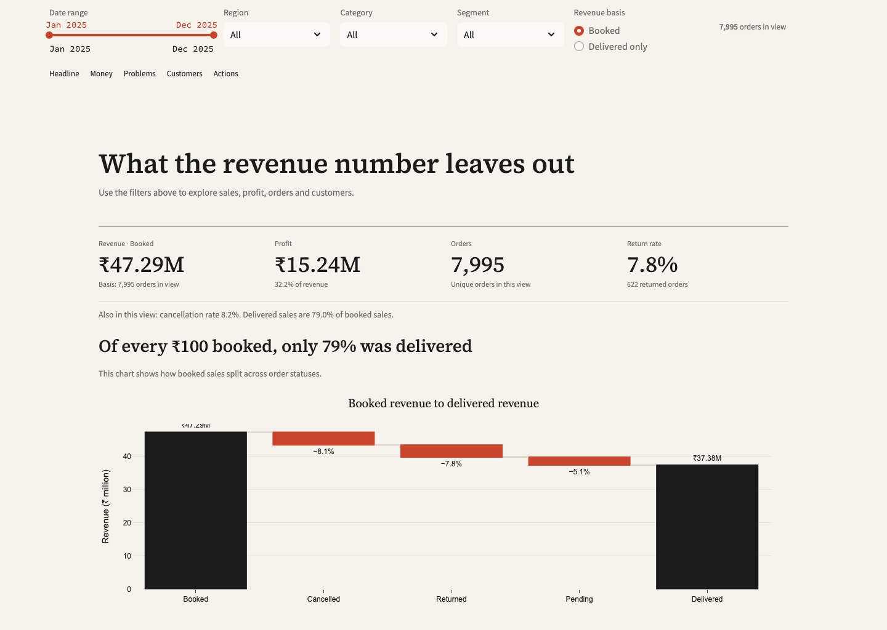
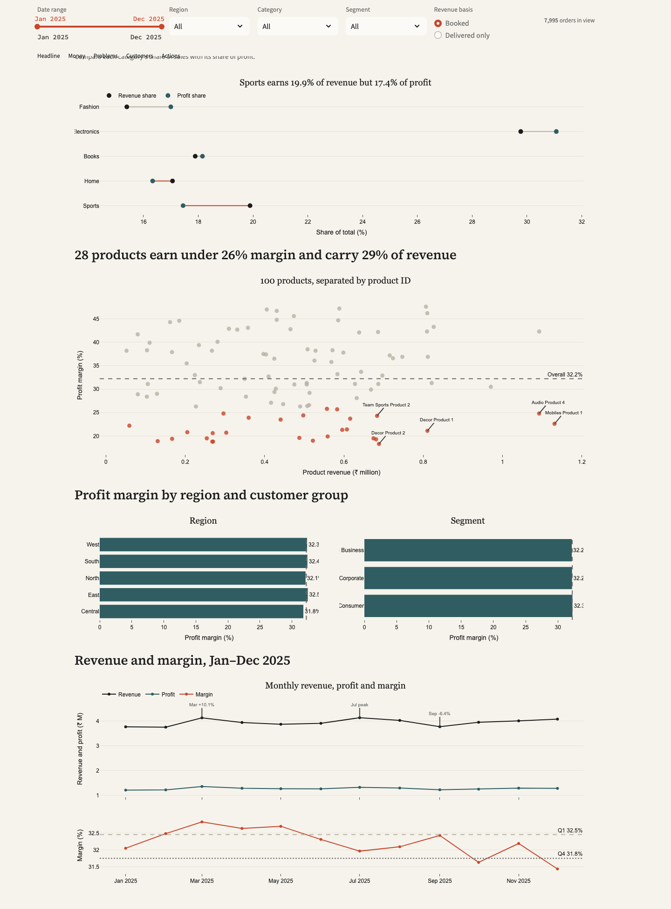
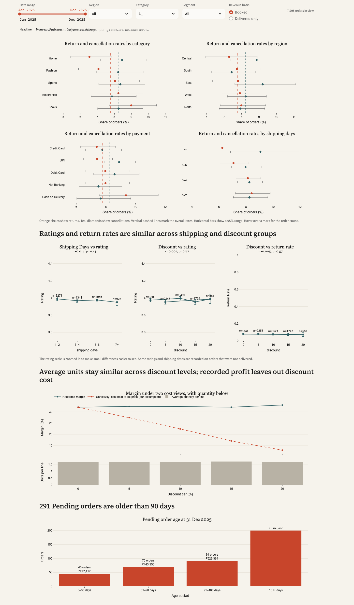
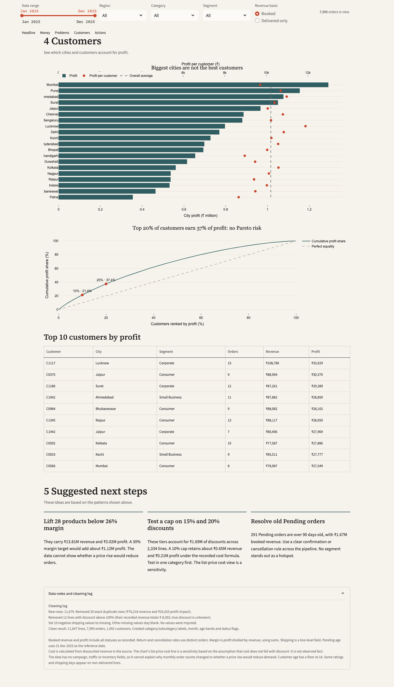

AI used: Yes, for dashboard code, visual design, and README drafting, and we can explain every part.

# THE DATA HUNT — Round 2

**Team Name:** SYNTORY  
**Team ID:** Not provided  
**Members:** Soham Mayekar, Devesh Kushe, Rudraksha Patil  

---

## 📊 Executive Overview & Validation

The dashboard compares booked and delivered revenue, profit, product margins, discounts, order outcomes, and customer value. Built as a unified, responsive single-page application with real-time filtering across date ranges, regions, categories, customer segments, and revenue bases (*Booked* vs *Delivered*).

### Section O Core Metrics (Booked Basis)

| Metric | Value | Details |
| :--- | :--- | :--- |
| **Cleaned Rows** | **11,647** | Item-level transaction lines |
| **Unique Orders** | **7,995** | Distinct orders analyzed |
| **Unique Customers** | **1,492** | Active customer base |
| **Booked Revenue** | **₹47,291,531.56** | Unfiltered gross recorded |
| **Booked Profit** | **₹15,240,690.01** | Unfiltered profit recorded |
| **Profit Margin** | **32.23%** | Total profit ÷ Total revenue |

---

## 📸 Dashboard Screenshots

### 1. Headline, Filters & Section O KPIs
*Sticky filter controls, high-level business metrics, and Booked-to-Delivered waterfall realization.*


### 2. Sales and Profitability
*Category dumbbell comparisons (revenue vs. profit share), product margin distribution (sub-26% margin flags), and quarterly trends.*


### 3. Operational Analysis: Where It Goes Wrong
*Simplified return & cancellation rates with 95% Wilson score confidence intervals, rating correlation matrices, discount cost sensitivities, and aging pending orders.*


### 4. Customer Concentration & Actionable Next Steps
*City-level profitability vs. per-customer value, Lorenz cumulative profit distribution (no Pareto risk), top customer leaderboard, prioritized actions, and audit logs.*


---

## 🧹 Data Cleaning Pipeline

The application processes raw input from `data/R_Questions.csv` at startup through `clean.py` and produces `data/cleaned_orders.csv`.

* **Duplicate Removal**: 20 exact duplicate rows eliminated (recorded revenue impact: ₹76,218; profit impact: ₹25,620).
* **Discount Outliers**: 12 rows with invalid discounts >100% removed (negative recorded revenue impact: ₹8,592; true discount unknown).
* **Shipping Days**: 10 impossible negative shipping-day values converted to null (`NaN`).
* **Missing Values**: Preserved intact without artificial imputation.
* **Feature Engineering**: Derived category and subcategory classifications, calendar month timestamps, customer age brackets, and normalized order status flags.

---

## 🔍 Key Findings (Q1 – Q5)

> **Note:** Values below reflect unfiltered figures on the default *Booked* basis. Metrics recompute dynamically upon applying filters in the dashboard.

### Q1. Money & Product Performance
* **Total Revenue**: ₹47,291,531.56 | **Total Profit**: ₹15,240,690.01 | **Overall Margin**: 32.23%
* **Category Leader**: **Electronics** generates the highest revenue (₹14,080,094) and highest profit (₹4,735,440).
* **Sports**: Accounts for 19.9% of revenue and 17.4% of profit.
* **Margins**: **Fashion** holds the highest category margin at **35.6%**, whereas **Sports** records the lowest at **28.3%**.

### Q2. Longitudinal Trends
* **Annual Trajectory**: Revenue remained broadly flat across calendar year 2025.
* **Peak Months**: **July** posted peak monthly revenue (₹4,130,653), while **March** delivered highest monthly profit (₹1,354,713).
* **Quarterly Growth**: Revenue expanded +3.3% from Q1 to Q4; profit increased +1.0%; profit margin moved from 32.5% to 31.8%.
* *Context constraint: The dataset contains no marketing campaign, web traffic, or inventory tracking records, meaning monthly variations cannot be attributed to specific external drivers.*

### Q3. Operational Hotspots & Correlations
* **Order Outcomes**: Overall return rate is **7.78%** (622 / 7,995 orders); cancellation rate is **8.23%** (658 / 7,995 orders).
* **Dimension Spread**: No single category, geographic region, payment channel, delivery speed band, age bracket, or segment exhibits an anomalous failure hotspot.
* **Statistical Associations**: All correlation coefficients are near zero and statistically non-causal:
  * Shipping days vs. Customer rating: $r = -0.014$ ($p = 0.14$)
  * Discount percentage vs. Customer rating: $r = +0.001$ ($p = 0.87$)
  * Discount percentage vs. Return probability: $r = -0.005$ ($p = 0.57$)
* *Takeaway: Expedited fulfillment or aggressive discounting do not demonstrate measurable impact on return rates or customer satisfaction.*

### Q4. Customer Economics
* **Concentration**: Top 10% of customers generate 21.4% of total profit; top 20% generate 37.4% (well distributed, healthy curve with no Pareto vulnerability).
* **Key Drivers**: Historical order frequency correlates more strongly with lifetime customer profitability than any demographic field.
* **Geography**: **Mumbai** leads in total cumulative city profit; **Lucknow** achieves the highest profit per customer.

### Q5. Recommended Business Actions
1. **Optimize 28 Low-Margin Products**: 28 items generate margins below 26%, representing ₹13.81M revenue and ₹3.02M profit. Elevating them to a 30% margin benchmark would generate ~₹1.12M in incremental profit (holding volume constant).
2. **Institute 10% Discount Cap in Pilot Category**: Tiers offering 15% and 20% discounts represent ₹1.69M in promotional concessions over 2,334 lines. Under standard recorded cost formulations, a 10% ceiling preserves ~₹0.65M in revenue and ~₹0.21M in profit.
3. **Resolve Stale Pending Pipeline**: 291 pending orders have remained unresolved for >90 days (representing ₹1.67M booked revenue relative to the 31 Dec 2025 baseline). Establish an automated order cancel/fulfill escalation workflow.

---

## 💡 Bonus Analytical Observations

* **Delivered Realization**: Only **₹37.38M** of the **₹47.29M** booked revenue (79.0%) reached *Delivered* status. The recorded accounting books profit even on undelivered/cancelled lines.
* **Cost Accounting Distortion**: Recorded cost scales proportionally with discounted prices, concealing margin degradation across heavy discount brackets. Our sensitivity analysis models what happens when true cost is fixed at list price.
* **Micro-Margin Spread**: Individual product margins fluctuate widely from **18.3% to 47.6%**, variance that category averages obscure.
* **Stale Pipeline**: Aging pending orders occur consistently throughout all 12 months rather than clustering at year-end.
* **Identifier Overlap**: The subcategory "Accessories" coexists in both *Electronics* and *Fashion*; product performance is strictly evaluated at `product_id` granularity.
* **Demographic Truncation**: Customer age is strictly bounded at $\ge 18$ (with 86 entries recorded at 18 vs 19 at 19).

---

## ⚠️ Analytical Caveats & Boundary Conditions

* **No Demand Elasticity**: In the absence of promotional spend, catalog impressions, and stockouts, demand elasticity cannot be modeled.
* **Sensitivity Model**: The list-price cost baseline is an explicit diagnostic sensitivity assumption, not an empirically observed accounting ledger.
* **Fixed Reference Date**: Pending order aging calculations use December 31, 2025 as the evaluation anchor.

---

## 🚀 Running the Dashboard Locally

Requires **Python 3.10+**.

```bash
# 1. Clone repository
git clone https://github.com/SohamMayekar/data-hunt-r2-dashboard.git
cd data-hunt-r2-dashboard

# 2. Install dependencies
pip install -r requirements.txt

# 3. Launch application
streamlit run app.py
```

*The application automatically executes `clean.py` upon launch, compares computed validation totals against expected Section O thresholds, and displays the full dashboard.*
